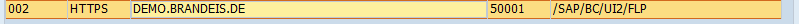
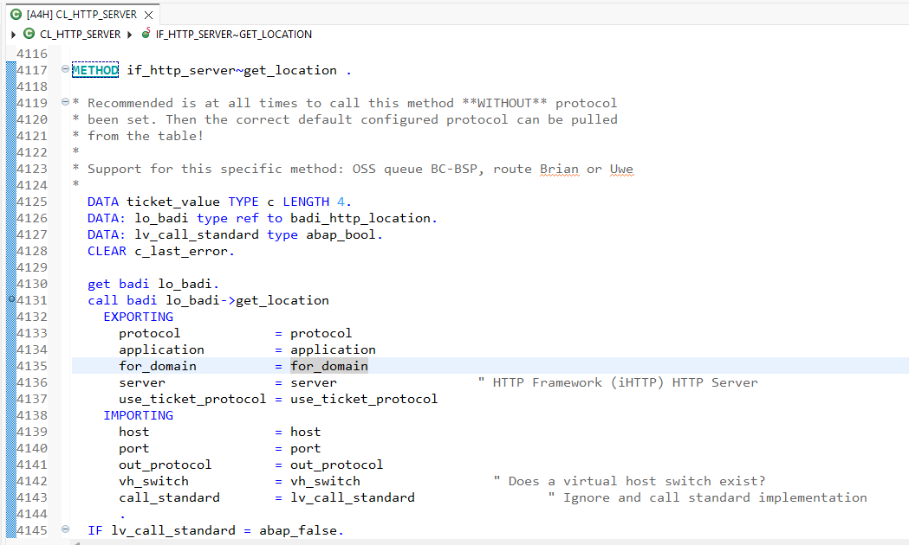
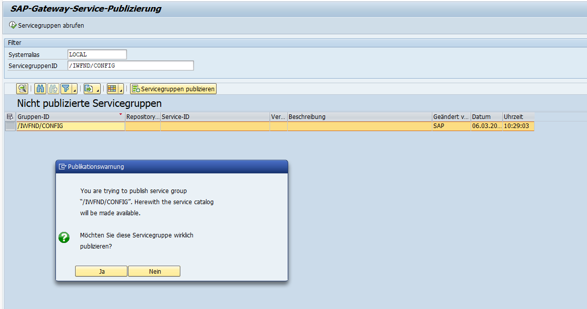

# DSAG_TechXChange2026

Vortrag und Coding für DSAG TechXChange 2026
Titel: P005: SOLUTION Walkthrough: Beyond the Surface: Mastering RAP and the Journey from Legacy to Clean Cor
Abstract: Move beyond simple tutorials and master the architectural heart of the ABAP RESTful Application Programming Model (RAP). This session dives deep into the execution engine, focusing on the critical Save Sequence and cascading calls necessary to guarantee data consistency in complex processes. We provide a clear, practical guide for the transition: successful refactoring from legacy data access and traditional BAPIs to modern EML calls. Learn to command the full power of the Clean Core architecture and prepare your development team for the next generation of SAP applications.

## Playbook

1. Vorstellung Presentatoren
2. (optional) Einführung Clean Core
3. Erstes Szenario: Abbildung eines einfachen Prozesses zur Automatisierung. User ruft nicht 3 Apps selbst auf, sondern wir führen es automatisiert aus. 
=> Wenn wir in ein S/4HANA private cloud 2023 schauen: wenige RAP BOs, viele BAPIs => wir machen selbst RAP Entwicklung (CCL1) und rufen dann aber BAPIs (CCL2) auf
4. (optional) Einführung RAP, RAP BOs (unmanaged und managed), Interaction-phase/TX Buffer/Save Sequence
5. The nature of BAPIs
6. Demo 1: Komplexer Prozess, bei dem Objekt B erst nach Commit von Objekt A erstellt werden kann => kaskadierender Aufruf mit bgPF oder was macht man, wenn man KEIN bgPF hat (zu altes Release) (Sören)
   - Folie mit Überblick, wo sind wir hier gerade in der Save-Sequence!
7. Demo 2: tbd bei Föß => Fiori Elements mit V2/V4?
8. Werbung: Was können wir hier für euch tun? Schulung, Projektmanagement etc. => Vorstellung Leistungsportfolio und Firmen
9. Q&A

## Titel und Abstract

### Modern ABAP meets Legacy Coding

## Organization

- Entwicklung auf interner ABAP Developer Trial 2023
- Anpassung der Launchpad-URL auf demo.brandeis.de
- Use Plugin [Draw.io Integration](https://marketplace.visualstudio.com/items?itemName=hediet.vscode-drawio)

## Administration

### Prepare Launchpad

Overview: [New Installation of SAP S/4HANA 2023 FPS0 – Part 4 – Rapid Activation for Fiorit](https://community.sap.com/t5/enterprise-resource-planning-blog-posts-by-sap/new-installation-of-sap-s-4hana-2023-fps0-part-4-rapid-activation-for-fiori/ba-p/13578176)

#### Set URL

- Open STC01
- Start Tasklist **SAP_FIORI_LAUNCHPAD_INIT_SETUP**
- Check **Konfiguration des SAP Web Dispatcher (HTTPURLLOC)**
- Enter the following Parameter:
- 
- The Application is the one, that is called with TCode /UI2/FLP
- This calls then this Coding:
- 

#### Activate Launchpad

- Open STC01
- Start Tasklist **SAP_FIORI_FOUNDATION_S4**

#### Activate Default Catalogs

- Open STC01
- Start Tasklist **SAP_FIORI_FCM_CATALOG_ACTIVATION**
- Under **Katalog-IDs für FLP-Content-Aktivierung bestätigen/auswählen** select there most relevant Roles

#### Activate some general stuff

- SAP_FIORI_FCM_CONTENT_ACTIVATION

#### App-Index Recalculation

- Run Programm: /UI5/APP_INDEX_CALCULATE

#### Error on my Home

- 3579948 - Error on "My Home" Page on Fiori Launchpad

#### V4 not found

- check 2948977 / [text](https://www.itsfullofstars.de/2023/11/odata-v4-service-group-is-not-published/)
- 

#### Deployment Error

- Error A:  
  - Solution: [Deployment to ABAP On-Premise System](https://ga.support.sap.com/index.html#/tree/3046/actions/45995:45996:50742:46000)
- Virus-Scan Profile:
  - Message: error abap-deploy-task ZDMO_SO No default virus profile active or found. Please check the offical guide.
  - Solution: [Fiori deploy fails due to missing virus scan profilet](https://www.itsfullofstars.de/2025/08/fiori-deploy-fails-due-to-missing-virus-scan-profile/)